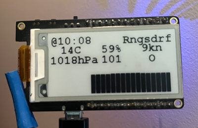

# E-Ink-Barometer

  


## Quick Start

Credentials are stored in a hidden.h file. 
An API Key can be obtained here for free <https://openweathermap.org>.
To find your citys ID, search for it and the URL reveals it:  ``` https://openweathermap.org/city/2643743 ``` .

```Cpp-ObjDump
constexpr char* ssid = "ssid";
constexpr char* passwd = "passwd";
constexpr char* api_key = "api_key";
constexpr char* city = "2643743"; //London

```

## Slow Start

The APIFetcher class creates a String from the credentials and performs a GET request on OpenWeatherAPI. On success it returns
a pointer to a Model object representing the deserialized JSON of the API´s response.

The Frame class assigns areas to the display. A frame is constructed with an upper left corner(x,y), width and length.

```Cpp-ObjDump
Display::Frame above(0, 0, 248, 64);
Display::Frame bottom(0, 64, 240, 64);
```

The IComponent interface implements 2 methods:

  ```Cpp-ObjDump	
    struct IComponent {
		virtual void paint(DisplayWrapper& display) = 0;
		virtual void update(const Model& data) = 0;
	  }; 
  ```
  
  update() restructures the Model to pixels and paint() uses the graphics library to display it.
  
  For now there are 2 Components:
  
  * Table
    Is implemented as 2D vector ``` std::vector<std::vector<Cell>> cells; ``` of type Cell, which is just a point x,y and a String       ``` message ```.
    
  
  * Barometer
 
 


## Hardware

LILYGO® TTGO T5 V2.3.1_2.13
* [Manufacturer] <http://www.lilygo.cn/prod_view.aspx?TypeId=50031&Id=1393>
* [GitHub] <https://github.com/Xinyuan-LilyGO/LilyGo-T5-ink-series>

## Libraries

* [Arduino core ESP32] <https://github.com/espressif/arduino-esp32>
* [GxEPD2] <https://github.com/ZinggJM/GxEPD2>
* [ArduinoJson] <https://github.com/bblanchon/ArduinoJson>

## Housing

* coming soon
